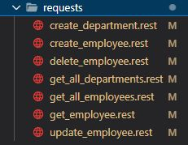
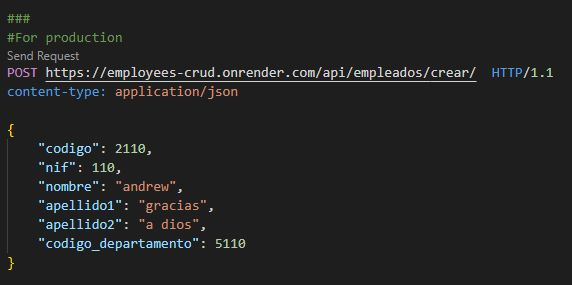

---
__Disclaimer:__ 
- This project was created to practice CRUD service for employees of a company, this works correctly.
- One objective was create a compose in docker to intergate database and server, but this is failing. It could be that a command is wrong, because when i compose up the server don't respond anything. I will solve it in the future.

***

**Explanation to use demo**
1. Clone this repository
2. Install pluggin of Rest Client in: https://marketplace.visualstudio.com/items?itemName=humao.rest-client
3. Send requests from requests folder. 
- Open requests folder

- Example of a post of an employee

__Note:__ click on POST where it says Send Request and wait for a response.

***

**Explanation of general operation for developers:** 
1. Clone this repository
2. Create and start a docker container for postgresql
3. Run server
4. Send requests from requests folder

# CRUD service for employees (CRUD = Create Read Update Delete)

## Create and start a PostgreSQL container:

    docker run --name db -e POSTGRES_USER=postgres -e POSTGRES_PASSWORD=postgres -e POSTGRES_DB=postgres -p 5432:5432 -d postgres

## Get sarted:
    1. Open a terminal in backend-empleados folder
    2. Create a virtual environment with the following command: python -m venv virt
    3. Activate virtual environment with the following command: source virt/Scripts/activate
    4. Install all dependences needed for the project with the following command: pip install -r requirements.txt
    5. Access folder crud with the following command: cd crud
    5. Run server on port 1234 with the following command: python manage.py runserver 1234

## make CRUD with Rest Client
Note: Rest Client is like a Postman, but is a plugging embedded for Visual Studio Code, and you can download here: https://marketplace.visualstudio.com/items?itemName=humao.rest-client 

**How can i CRUD?**
It's very simply, you can open "requests" folder in the project, and there are some files with ".rest" extension. Open each one and click on the link "Send Request" that is above the first line. That's all, look the response of each request.
